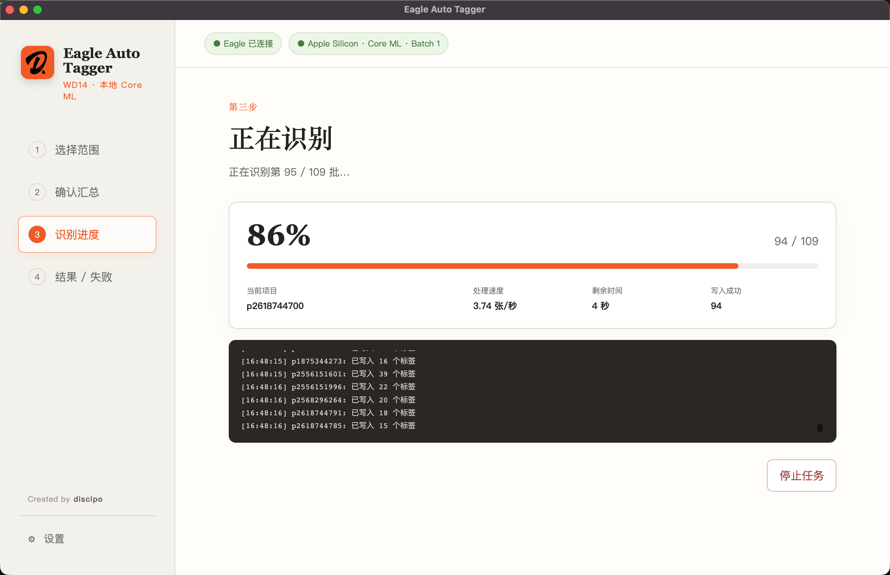
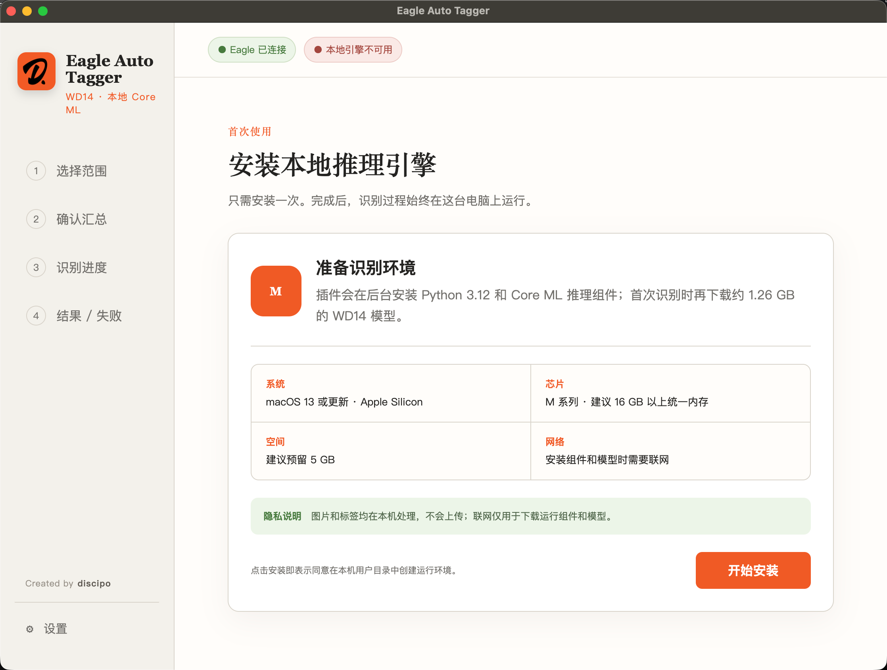
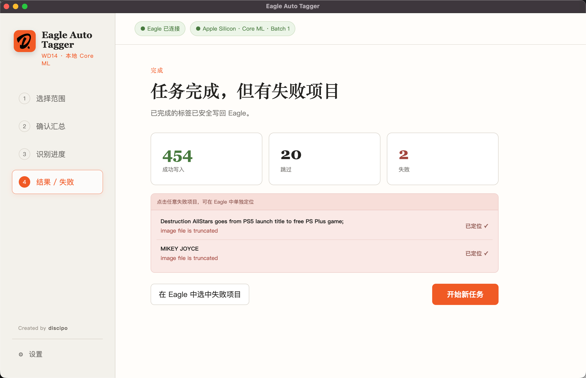

# Eagle Auto Tagger · Mac 版

用 WD14 模型给 [Eagle](https://eagle.cool) 素材库自动打标签。**全部在本机运行**，图片不上传。

收藏了几万张素材约等于没收藏——因为找不到。手动打标签没人愿意做，所以有了这个插件。

---

## 运行要求

| 项目 | 要求 |
|---|---|
| 芯片 | Apple Silicon（M1/M2/M3/M4）。**暂不支持 Intel Mac** |
| 系统 | macOS 13 或更新 |
| Eagle | **必须是 Apple Silicon 原生版**，不能是 Rosetta 运行的 Intel 版 |
| 磁盘 | 预留 5 GB（模型 1.2 GB + 推理缓存 2.4 GB + 运行环境） |
| 网络 | 仅首次安装需要 |

> **怎么确认 Eagle 是原生版**：活动监视器 → 找到 Eagle → 看「种类」列，应为 Apple 而不是 Intel。
> 插件启动时也会自动检测，如果是 Rosetta 会直接提示。

## 安装

1. 到 [Releases](../../releases/latest) 下载 `.eagleplugin` 文件
2. 双击安装，Eagle 会自动导入
3. 在 Eagle 插件面板打开 Eagle Auto Tagger，点「开始安装」
4. 等待运行环境准备完成（几分钟，取决于网速）
5. 第一次识别时会下载 WD14 模型（约 1.26 GB），有进度显示和断点续传

> ⚠️ **不要手动双击插件目录里的 `engine/tools/uv`**。那是安装工具，手动打开会被 macOS 拦截并**记住这次拒绝**，之后插件自己调用也会失败。交给插件自动处理即可。

## 首次使用会慢，这是正常的

| 阶段 | 耗时 | 说明 |
|---|---|---|
| 装运行环境 | 几分钟 | 一次性 |
| 下载模型 | 1.26 GB | 一次性，支持断点续传 |
| 首次 Core ML 编译 | 约 20 秒 | 界面会提示「正在首次编译 Core ML 模型」，**不是卡死** |

之后每次启动都复用缓存，秒开。

## 每批张数保持 1

界面里可以调「每次推理张数」，但 **Apple Silicon 上 1 张最快**：

| 配置 | 速度 |
|---|---|
| **Core ML batch=1** | **约 3.4–3.7 张/秒** |
| Core ML batch=2 | 0.91 张/秒 |
| Core ML batch=4 | 0.91 张/秒 |
| 纯 CPU 回退 | 0.62 张/秒 |

*（M2 Max 实测，端到端——含读图、推理、写回 Eagle。纯推理峰值可达 4.78 张/秒，但日常看到的是端到端数字。）*

这和 NVIDIA 显卡的经验**相反**——在 Apple Silicon 上调大 batch 不仅更慢，还要重新编译一次模型、多占 2.4 GB 缓存。除非你想自己对比，否则保持默认的 1。

上图是一次真实的批量任务：454 张成功写入，20 张因为已有标签被自动跳过，2 张失败（源文件本身损坏）。失败项可以一键在 Eagle 中选中定位。

## 隐私

图片和标签全部在本机处理，不会上传任何地方。没有账号系统、没有遥测、没有行为统计。

联网只发生在两处：下载运行组件（PyPI）、下载 WD14 模型（hf-mirror / Hugging Face）。

详见 [PRIVACY.md](PRIVACY.md)。

## 卸载

1. 在 Eagle 插件面板移除插件
2. 删除 `~/Library/Application Support/EagleAutoTagger`（访达按 ⇧⌘G 前往）

卸载插件不会自动删这个目录，避免你重装时重复下载 1.26 GB 模型。

## 常见问题

**提示检测到 Rosetta**
装 Apple Silicon 原生版 Eagle。混用 x64 Eagle 和 arm64 推理组件会导致 Core ML 不可用。

**安装时 Connection refused / 下载失败**
检查网络或代理。插件已内置国内镜像兜底（Python 走南京大学镜像、模型走 hf-mirror），重试一般能过。

**提示「安装工具被系统安全策略终止」**
在访达里右键点插件包选「打开」，或按界面提示在终端执行给出的 `xattr` 命令。这是 macOS Gatekeeper 对未公证二进制的拦截。

**识别结果是英文标签**
WD14 模型输出的就是英文 danbooru 风格标签，这是模型本身的特性。

## 源码

当前提供预编译包。源码整理后开源。

Windows 版本另行维护，本仓库只覆盖 macOS（Apple Silicon）。

## 第三方组件

本插件使用了 uv、ONNX Runtime、WD14 模型等第三方组件，许可信息见 [THIRD_PARTY_NOTICES.md](THIRD_PARTY_NOTICES.md)。

模型来自 [SmilingWolf/wd-eva02-large-tagger-v3](https://huggingface.co/SmilingWolf/wd-eva02-large-tagger-v3)。
